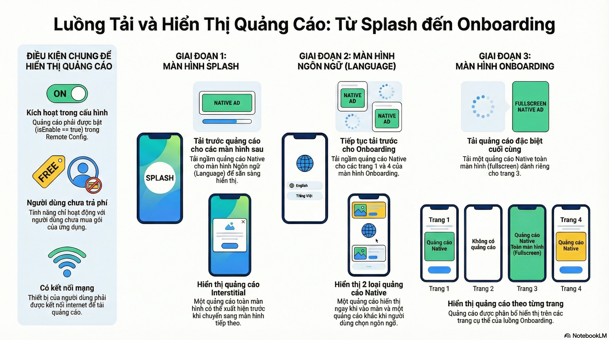

# Infinity विज्ञापन और प्राथमिकताएं गाइड

📊 **[विज्ञापन लोड और शो का आरेख देखें](ad_flow_diagram.md)** - Splash, Language, Onboarding

यह प्रोजेक्ट एक स्थानीय डीबग विज्ञापन कॉन्फ़िगरेशन और एक एकल साझा प्राथमिकताएं प्रविष्टि बिंदु के साथ आता है ताकि स्क्रीन के बीच ऑनबोर्डिंग स्थिति संरेखित रहे। इस दस्तावेज़ का लक्ष्य यह समझाना है कि कोडबेस में खुदाई किए बिना `ad_config_debug.json` और `appSharedPref` के साथ कैसे काम करें।

## डीबग विज्ञापन कॉन्फ़िगरेशन (`ad_config_debug.json`)

- स्थान: `app/src/main/assets/ad_config_debug.json`।
- दायरा: केवल डीबग बिल्ड में लोड किया गया। रिलीज़ बिल्ड `ad_config.json` या Firebase Remote Config द्वारा लौटाए गए पेलोड को पढ़ते हैं।
- उपभोक्ता: `AdRemoteConfig` प्रत्येक कुंजी के लिए दृढ़ता से टाइप किए गए गेटर्स को उजागर करता है और `RemoteConfigUtils` फ़ाइल का उपयोग Firebase Remote Config में धकेले गए डिफ़ॉल्ट मानचित्र को बनाने के लिए करता है (ताकि आपके पास हमेशा ऑफ़लाइन सुरक्षित फ़ॉलबैक हों)।

### फ़ाइल संपादित करें

1. शीर्ष-स्तरीय संरचना को एक मानचित्र के रूप में रखें जहां प्रत्येक प्रविष्टि नाम ऐप के अंदर उपयोग की जाने वाली समान कुंजी है (`inter_splash`, `native_language_1`, आदि)।
2. प्रत्येक प्रविष्टि के लिए प्रदान करें:
   - `id`: AdMob (या मध्यस्थ) प्लेसमेंट आईडी।
   - `isEnable`: प्रति प्लेसमेंट त्वरित सक्षम/अक्षम करने की अनुमति देने के लिए टॉगल।
   - बैनर के लिए वैकल्पिक `reloadIntervalSeconds`।
3. मान्य JSON का पालन करें। `AdRemoteConfig` में Moshi एडाप्टर तेजी से विफल हो जाता है जब कोई फ़ील्ड गायब या विकृत होती है।

उदाहरण:
```
{
  "banner_splash": {
    "id": "ca-app-pub-xxx/yyy",
    "isEnable": true,
    "reloadIntervalSeconds": 30
  }
}
```

### आरंभीकरण और रिफ्रेश

- विज्ञापन मॉड्यूल बहुत जल्दी `AdRemoteConfig.initialize(context)` चलाकर खुद को बूटस्ट्रैप करता है (आमतौर पर `GlobalApp` के अंदर)।
- जब `BuildConfig.DEBUG` सत्य है, तो इनिशियलाइज़र हमेशा `ad_config_debug.json` पढ़ता है। किसी रिमोट कॉल की आवश्यकता नहीं है।
- `RemoteConfigUtils.init(context, listener)` समान डिफ़ॉल्ट को Firebase Remote Config में लोड करता है और फिर उपलब्ध होने पर लाइव ओवरराइड प्राप्त करता है।
- यदि आप ऐप चलने के दौरान JSON फ़ाइल बदलते हैं, तो प्रक्रिया को पुनरारंभ किए बिना इसे पुनः लोड करने के लिए `AdRemoteConfig.reset()` के बाद `AdRemoteConfig.initializeFromAssets(context)` को कॉल करें।

### रिमोट ओवरराइड प्राप्त करें

- Firebase Remote Config में `ad_remote_config` नामक एक JSON स्ट्रिंग जोड़ें जो समान संरचना को दर्शाती है। उपयोगिता विधि `RemoteConfigUtils.getAdRemoteConfig()` एक बार `fetchAndActivate()` समाप्त होने पर कच्ची स्ट्रिंग लौटाती है।
- रनटाइम पर रिमोट ओवरराइड लागू करने के लिए:
  1. `RemoteConfigUtils.getAdRemoteConfig()` को कॉल करें।
  2. जब स्ट्रिंग खाली नहीं है, तो `AdRemoteConfig.initializeFromJson(jsonString)` को आमंत्रित करें।
  3. `AdRemoteConfig.getInstance()` का उपयोग करने वाले सभी कॉलर तुरंत नए प्लेसमेंट की सेवा करना शुरू कर देंगे।

### समस्या निवारण

- यदि कोई कुंजी गायब है, तो `AdRemoteConfig` Timber के साथ एक चेतावनी लॉग करता है और एक अक्षम प्लेसहोल्डर लौटाता है ताकि UI विज्ञापन स्लॉट को सुंदर ढंग से रेंडर करना छोड़ सके।
- सुनिश्चित करें कि प्रत्येक नई प्लेसमेंट कुंजी में `AdRemoteConfig` में एक मिलान संपत्ति है ताकि संकलन-समय सुरक्षा बनी रहे।

## विज्ञापन भाषा लेआउट (`ad_language_layout.json`)

- स्थान: `app/src/main/assets/ad_language_layout.json`।
- उद्देश्य: भाषा/ऑनबोर्डिंग प्रवाह पर उपयोग किए गए मूल विज्ञापन लेआउट के लिए टाइपोग्राफी, पैडिंग और रंग परिभाषित करता है।
- फ़ॉलबैक प्रवाह: `RemoteConfigUtils.getAdLanguageLayout()` पहले इस संपत्ति को लोड करता है और केवल Remote Config मान (`ad_language_layout`) के साथ इसे प्रतिस्थापित करता है जब एक गैर-खाली पेलोड मौजूद होता है।

### स्थानीय रूप से अनुकूलित करें

1. आकार, रंग, या स्पेसिंग कुंजियों जैसे `headlineTextSize`, `contentPadding`, या `callToActionBackgroundColor` को समायोजित करने के लिए संपत्तियों में JSON फ़ाइल संपादित करें।
2. `AdRemoteConfig.reset()` + `AdRemoteConfig.initializeFromAssets(context)` को कॉल करके या बस डीबग बिल्ड को पुनः स्थापित करके हॉट रीलोड करें।

### Remote Config से ओवरराइड करें

1. समान JSON संरचना के साथ `ad_language_layout` नामक एक Remote Config पैरामीटर बनाएं।
2. `RemoteConfigUtils.fetchAndActivate()` पूर्ण होने के बाद, नई JSON स्ट्रिंग स्वचालित रूप से संपत्ति को ओवरराइड करती है जब `RemoteConfigUtils.getAdLanguageLayout()` को आमंत्रित किया जाता है।
3. दृश्य परत में क्रैश को रोकने के लिए स्कीमा को समान रखें।

## ऑनबोर्डिंग विज्ञापन प्रदर्शन नियम

ऑनबोर्डिंग प्रवाह केवल उच्च-प्रभाव विज्ञापन प्लेसमेंट को रेंडर करता है जब Firebase Remote Config और SDK-साइड गेटिंग विधियां दोनों सहमत होती हैं कि स्लॉट दिखाना चाहिए। संदर्भ के रूप में नीचे दिए गए स्निपेट का उपयोग करें:

```
if (ERainAd.getInstance().shouldDisplayNativeOnboardingFull1) {
    AdsManager.loadNativeOnboardingFull(
        this,
        appSharedPref.firstOnBoarding,
        R.layout.layout_native_onboarding_full
    )
}
```

- `native_onboarding_full_1`: `AdRemoteConfig.native_onboarding_fullscreen_1_3.isEnable == true` और `ERainAd.getInstance().shouldDisplayNativeOnboardingFull1 == true` की आवश्यकता है। किसी भी पुराने `organic` फ्लैग चेक को हटा दें।
- `native_onboarding_full_2`: `AdRemoteConfig.native_onboarding_fullscreen_2_3.isEnable == true` और `ERainAd.getInstance().shouldDisplayNativeOnboardingFull2 == true` की आवश्यकता है। `organic` को हटा दें।
- `inter_onboarding`: `AdRemoteConfig.inter_onboarding.isEnable == true` (या आपके कॉन्फ़िगरेशन द्वारा परिभाषित समकक्ष कुंजी) और `ERainAd.getInstance().shouldDisplayInterOnboarding() == true` की आवश्यकता है। `organic` को हटा दें।
- विजेट अनइंस्टॉल बिल्ड: विजेट को सतह पर न लाएं जब `ERainAd.getInstance().shouldDisplayWidgetUninstall() == false`, रिमोट कॉन्फ़िगरेशन की परवाह किए बिना। किसी भी पुराने `organic` फ़िल्टर को इस विधेय से बदलें।

## साझा प्राथमिकताएं (`appSharedPref`)

`appSharedPref` प्रत्येक `BaseActivity` और `BaseDialog` में इंजेक्ट की गई एकल निर्भरता है जो स्क्रीन स्थिति प्रदान करती है। यह `AppSharedPreferencesApp` द्वारा समर्थित है, जो Android `SharedPreferences` को दृढ़ता से टाइप की गई गुणों के साथ लपेटता है।

### संग्रहीत फ्लैग

- `languageCode`: अंतिम चयनित भाषा, डिफ़ॉल्ट `en`।
- `firstLanguage`: उपयोगकर्ता द्वारा भाषा पिकर समाप्त करने तक सत्य।
- `firstOnBoarding`: ऑनबोर्डिंग पूर्ण होने तक सत्य।
- `isConfirmConsent`: चिह्नित करता है कि GDPR सहमति एकत्र की गई है।
- `isUserGlobal`: इंगित करता है कि उपयोगकर्ता GDPR-आवश्यक क्षेत्र में है।

### विशिष्ट उपयोग

- गतिविधियां नेविगेशन निर्णयों के दौरान `appSharedPref` को कॉल करती हैं। उदाहरण के लिए, `SplashActivity` केवल तभी सहमति संवाद खोलती है जब `isConfirmConsent` गलत है और `isUserGlobal` सत्य है।
- `LanguageActivity` `languageCode` को अपडेट करती है और `firstOnBoarding` को फ्लिप करती है ताकि नियंत्रित किया जा सके कि ऑनबोर्डिंग फिर से दिखाई देती है या नहीं।

एक्सेस पैटर्न उदाहरण:
```
appSharedPref.firstOnBoarding = false
appSharedPref.languageCode = isoCode
if (appSharedPref.isConfirmConsent.not()) {
    showConsentDialog()
}
```

### सर्वोत्तम प्रथाएं

- सीधे `SharedPreferences` पढ़ने से बचें। इसके बजाय `AppSharedPref` को इंजेक्ट करें ताकि इंस्ट्रूमेंटेशन परीक्षण इसे इन-मेमोरी फेक के साथ बदल सकें।
- सत्य के एकल स्रोत और डिफ़ॉल्ट मानों की गारंटी के लिए `AppSharedPreferencesApp` के अंदर नई कुंजियां रखें।
- जब आप एक नया बूलियन फ्लैग जोड़ते हैं, तो हमेशा एक ऐसा नाम चुनें जो `is`, `has`, या `can` से शुरू होता है ताकि कोड स्व-व्याख्यात्मक रहे।

इन दो टुकड़ों (डीबग विज्ञापन कॉन्फ़िगरेशन + साझा प्राथमिकताएं) को समझने के साथ, आप अप्रत्याशित प्रतिगमन के बिना विज्ञापन प्लेसमेंट और ऑनबोर्डिंग प्रवाह पर सुरक्षित रूप से पुनरावृत्ति कर सकते हैं।

### उत्पादन `ad_config.json` रिफ्रेश

- रिलीज़ बिल्ड डिफ़ॉल्ट रूप से `app/src/main/assets/ad_config.json` पढ़ते हैं।
- स्टोर में फिर से सबमिट किए बिना हॉटफिक्स भेजने के लिए, Remote Config कुंजी `ad_remote_config` के तहत समान JSON अपलोड करें। `fetchAndActivate()` के बाद, कॉल करें:

```kotlin
RemoteConfigUtils.getAdRemoteConfig()
    .takeIf { it.isNotBlank() }
    ?.let(AdRemoteConfig::initializeFromJson)
```

यह रनटाइम पर नए प्लेसमेंट के साथ `AdRemoteConfig` को पुनर्जलीकृत करता है।

## विज्ञापन पैकेज अवलोकन (`app/src/main/java/com/itg/template/ads`)

| फ़ाइल | जिम्मेदारी |
| --- | --- |
| `AdRemoteConfig.kt` | JSON संपत्तियों/Remote Config पेलोड को लोड करता है और प्रति प्लेसमेंट टाइप किए गए गेटर्स को उजागर करता है। |
| `AdRemoteConfigExtensions.kt` | दृढ़ता से टाइप की गई कुंजियों जैसे `inter_splash`, `native_language_1`, आदि के लिए सुविधा val एक्सटेंशन। |
| `RemoteConfigUtils.kt` | Firebase Remote Config को बूटस्ट्रैप करता है, स्थानीय डिफ़ॉल्ट को धकेलता है, सहायक गेटर्स को उजागर करता है (`getAdRemoteConfig()`, `getAdLanguageLayout()`, `getForceUpdateConfig()`)। |
| `AdsManager.kt` | सभी विज्ञापन ऑब्जेक्ट्स (इंटरस्टिशियल, नेटिव, ऑनबोर्डिंग फुल-स्क्रीन) के लिए केंद्रीकृत लोडर/कैशर। नेटवर्क स्थितियों और खरीद स्थिति का निरीक्षण करता है। |
| `AdExtension.kt` | कस्टम लेआउट में Google Native विज्ञापनों को भरने के लिए सहायक (CTA आकार, शिमर हैंडलिंग)। |

### विशिष्ट प्रवाह

1. `GlobalApp` `RemoteConfigUtils.init()` को कॉल करता है और `ERainAd.getInstance().prepareLoadingAdsDialogLayout` को असाइन करता है।
2. `AdRemoteConfig.initialize()` स्टार्टअप पर एक बार चलता है। प्रत्येक स्क्रीन `AdRemoteConfig.<key>` या एक्सटेंशन vals के माध्यम से प्लेसमेंट का संदर्भ देती है।
3. UI परतें कभी भी कच्चे JSON को नहीं छूती हैं। वे `AdsManager.load...`/`show...` को कॉल करते हैं, या वैकल्पिक कंटेनर रेंडर करने से पहले `AdRemoteConfig.<key>.isEnable` की जांच करते हैं।

### एक नया प्लेसमेंट जोड़ना

1. नई कुंजी के साथ `ad_config_debug.json` / `ad_config.json` का विस्तार करें।
2. `AdRemoteConfigExtensions.kt` में एक संपत्ति जोड़ें ताकि Kotlin कॉलर टाइप-सुरक्षित तरीके से कुंजी पढ़ सकें।
3. तय करें कि `AdsManager` के अंदर संसाधन को कहां प्रीलोड करना है।
4. ऐप को एक बार फिर से चलाकर Remote Config डिफ़ॉल्ट को अपडेट करें (मान `RemoteConfigUtils` डिफ़ॉल्ट के माध्यम से अपलोड किया जाता है) या मैन्युअल रूप से Remote Config कंसोल को संपादित करें।

## फोर्स अपडेट डायलॉग (`force_update_config.json`)

- स्थान: `app/src/main/assets/force_update_config.json`।
- रिमोट कुंजी: Firebase Remote Config में `force_update_config` (स्ट्रिंग)। जब रिमोट पेलोड खाली होता है तो स्थानीय संपत्ति को डिफ़ॉल्ट मान के रूप में उपयोग किया जाता है।
- डेटा मॉडल: [`ForceUpdateConfig`](app/src/main/java/com/itg/template/data/model/ForceUpdateConfig.kt)।
- उपभोक्ता: `RemoteConfigUtils.getForceUpdateConfig()` JSON को पार्स करता है और `MainActivity` Auto/Manual Force Update डायलॉग दिखाती है (`button_show_force_update` देखें)।

### JSON स्कीमा

```json
{
  "icon": "https://.../force_icon.png",
  "title": "अपडेट आवश्यक",
  "description": "नई सुविधाएं और सुधार आपका इंतजार कर रहे हैं।",
  "storeLink": "https://play.google.com/store/apps/details?id=com.itg.template",
  "minVersionCode": 123,
  "force": true
}
```

| फ़ील्ड | विवरण |
| --- | --- |
| `icon` | कॉपी के ऊपर दिखाया गया वैकल्पिक URL। लॉन्चर आइकन पर वापस आता है। |
| `title` | वैकल्पिक। खाली होने पर ऐप नाम पर डिफ़ॉल्ट होता है। |
| `description` | वैकल्पिक। `force_update_message` पर डिफ़ॉल्ट होता है। |
| `storeLink` | Google Play डीप लिंक। स्वचालित प्रॉम्प्ट के लिए आवश्यक। |
| `minVersionCode` | प्रॉम्प्ट करने से पहले आवश्यक न्यूनतम `BuildConfig.VERSION_CODE`। |
| `force` | जब `true` होता है, तो डायलॉग रद्द करने योग्य नहीं होता है। |

`RemoteConfigUtils.init()` पूर्ण होने के बाद, `maybeShowForceUpdateDialog()` रिमोट पेलोड की तुलना इंस्टॉल किए गए `versionCode` से करता है और `ForceUpdateDialog` के माध्यम से `dialog_force_update.xml` को रेंडर करता है। `MainActivity` में "Show Force Update" बटन अंतिम प्राप्त कॉन्फ़िगरेशन का पुन: उपयोग करता है ताकि QA तुरंत डायलॉग का पूर्वावलोकन कर सके।

## ब्लर-आधारित सिस्टम डायलॉग

- `BlurLoadingLayout` (`layout_prepare_ads.xml`, `dialog_no_internet.xml`, `dialog_force_update.xml` के लिए रूट) अंतर्निहित विंडो को कैप्चर करता है और इसे iOS-जैसे ओवरले ब्लर के लिए [BlurView](https://github.com/Dimezis/BlurView) को फीड करता है।
- `NoInternetDialog` और `ForceUpdateDialog` (`ui/component/main/dialog` में स्थित) पुन: प्रयोज्य सहायक हैं जो उन लेआउट को इन्फ्लेट करते हैं, बटन कॉलबैक को संभालते हैं, और गतिविधि परत को `show()/dismiss()` को उजागर करते हैं।
- डायलॉग स्वचालित रूप से वर्तमान गतिविधि का स्नैपशॉट लेते हैं, इसलिए तीसरे पक्ष के ओवरले भी गतिविधि में अतिरिक्त कोड के बिना धुंधली पृष्ठभूमि को विरासत में लेते हैं।

### पूर्वावलोकन / मैनुअल ट्रिगर

- `activity_main.xml` में `button_show_force_update` कैश किए गए Remote Config पेलोड (या स्थानीय फ़ॉलबैक) का उपयोग करके `ForceUpdateDialog` को ट्रिगर करता है। यह Remote Config को बदले बिना कॉपी और डिज़ाइन की समीक्षा करने के लिए QA के दौरान उपयोगी है।
- नेटवर्क हानि की निगरानी `ConnectionLiveData` के माध्यम से की जाती है; `NoInternetDialog` स्वचालित रूप से प्रकट होता है जब भी पर्यवेक्षक `false` उत्सर्जित करता है, और जैसे ही कनेक्टिविटी बहाल होती है, खारिज कर दिया जाता है।
